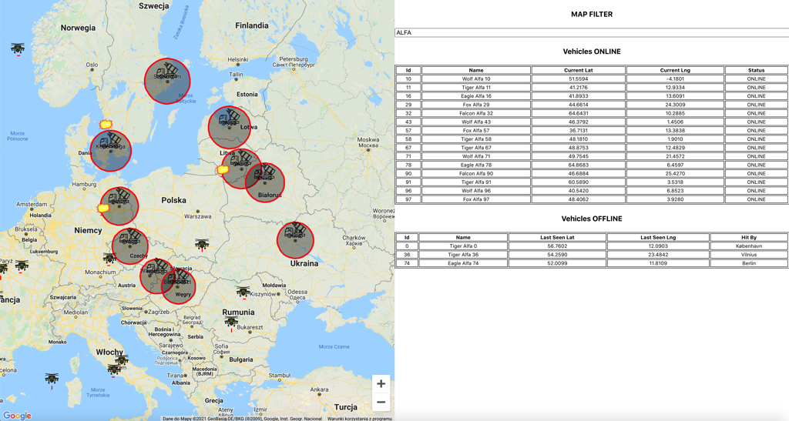

# Battle Tracking Monitor


## Menu:
* [Website](#web)
* [Description](#description)
* [Preview](#preview)
* [Technologies](#technologies)
* [Instalation](#instalation)


## Website
* https://bright-inventions-jarekit.netlify.app/ - LIVE PREVIEW
* https://bright-inventions-jarekit.herokuapp.com/API/v1/ - BACKEND API


## Description
* Web page connects to [API](http://localhost:3001/) to get the position of vehicles and enemies.
* Position of vehicles is updated every 1000 ms.
* Every vehicle randomly moves 25 km every 1000 ms.
* Vehicles have a red path, showing from what direction they came.
* Enemies are static missile launchers protecting Capitals in the range of 150 km.
* When the vehicle is within range of the missile, it is destroyed and the connection to the vehicle is lost.
* You can click on the vehicle or enemy on the map to get details
* You can filter vehicles on the map by vehicle name


## Preview
* Two vehicles were shoot down:


* Map screen with vehicles, enemies and shooted vehicles:


* Vehicles were filtered by name ALFA:




## Technologies
* Frontend: React - framework for JavaScript (dependencies: TypeScript, @react-google-maps, lodash, prettier, eslint, dotenv, axios)
* Backend: NestJS - framework for Node.js (dependencies: TypeScript, prettier, eslint)


## Instalation

### Server instructions:

Clone repository:
```sh
$ git clone https://github.com/JarekIT/bright-inventions-backend.git
```
To install all needed packages on the server:
```sh
$ npm run install
```
To start the server in development mode:
```sh
$ npm run start
```
To build server:
```sh
$ npm run build
```

### Client instructions:

Clone repository:
```sh
$ git clone https://github.com/JarekIT/bright-inventions-frontend.git
```
To install all needed packages on the client:
```sh
$ npm run install
```
To use google maps, insert your GOOGLE-MAPS-API-KEY in `index.html` file in the `/public` folder
```sh
<script src="https://maps.googleapis.com/maps/api/js?key=YOUR-GOOGLE-MAPS-API-KEY"></script>
```
Create a `.env` file in the `root folder` and insert your API-KEY and API-URL in the following format of KEY=VALUE:
```sh
$ REACT_APP_GOOGLE_MAPS_API_KEY = YOUR-GOOGLE-MAPS-API-KEY
$ REACT_APP_API_URL = http://localhost:3001/API/v1/
or
$ REACT_APP_API_URL = http://bright-inventions-jarekit.herokuapp.com/API/v1/
```

To start the client in development mode:
```sh
$ npm run start
```
To build client:
```sh
$ npm run build
```


### Quick Preview instructions:

Clone multi repository:
```sh
$ git clone https://github.com/JarekIT/bright-inventions-all.git
```
To install concurrently dependency:
```sh
$ npm run install
```
To install the server and the client needed packages:
```sh
$ npm run installAll
```
To start the server and the client in development mode:
```sh
$ npm run devAll
```


### Summary:

Instalations runs the app in the development mode.<br />
Client will start on: [http://localhost:3000/](http://localhost:3001/) <br />
Server will start on: [http://localhost:3001/](http://localhost:3001/) <br />